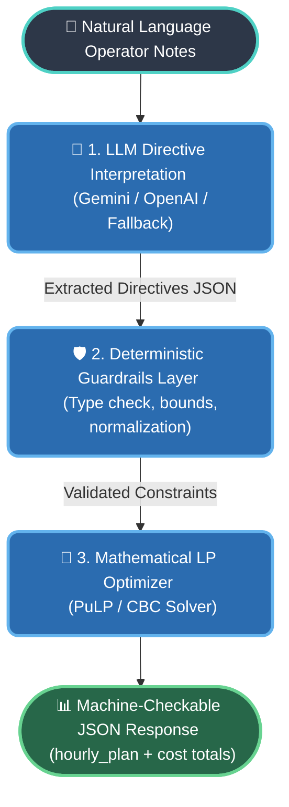
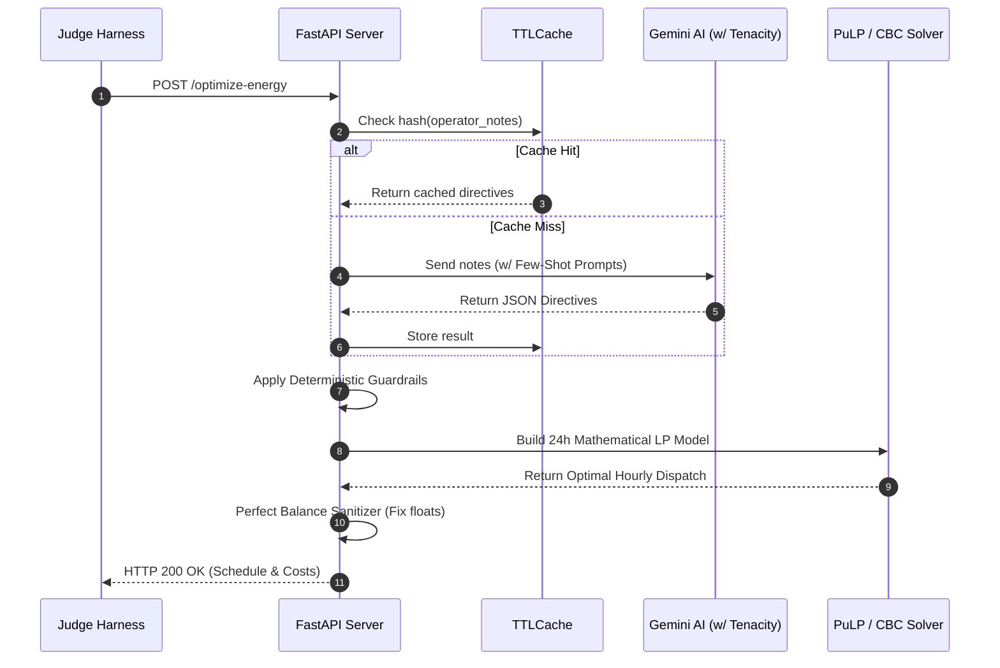

# GridWise: LLM-Assisted Smart Campus Energy Optimization Service

**BUP CSE Fest 2026 — Hackathon Online Preliminary Round**  
**Team**: KUET_noobs  
**Repository**: [KUET_noobs-BUP_Hackathon](https://github.com/AbirHasanArko/KUET_noobs-BUP_Hackathon)

---

## 1. Executive Summary & Problem Overview

The **GridWise Smart Campus Energy Optimization System** automates the end-to-end operational scheduling of campus electricity demand, rooftop solar generation, and battery energy storage over a 24-hour horizon. The system integrates natural language processing via Generative AI (LLMs) with strict deterministic guardrails and mathematical linear programming (LP) optimization to minimize grid electricity costs while maintaining 100% operational feasibility, battery health, and constraint satisfaction.

---

## 2. System Architecture

The service follows a three-stage decoupled pipeline:



### Request Lifecycle Sequence



1. **LLM Directive Interpretation**: Translates complex, paraphrased campus operator notes into structured directive objects. Supports Google Gemini, OpenAI, Groq, and custom OpenAI-compatible endpoints, along with an offline heuristic fallback engine.
2. **Deterministic Guardrails Layer**: Enforces strict schema rules, validates unique ascending hours (`0..23`), clamps solar factors `[0.0, 1.0]`, verifies battery reserve limits, and validates `no_op` semantics (`applies = false` and `structured_adjustment = null`).
3. **Linear Programming Optimizer**: Solves the 24-hour energy dispatch model using the `PuLP` Mixed Integer/Linear Programming solver to guarantee mathematically optimal electricity costs while enforcing energy balance, rate limits, and end-of-day battery neutrality.

---

## 3. Supported Directive Types

| Directive Type | Meaning | Required `structured_adjustment` Shape |
| :--- | :--- | :--- |
| `solar_reduction` | Reduces usable solar generation during specific hours | `{"hours": [12, 13], "factor": 0.25}` |
| `minimum_battery_reserve` | Maintains battery energy at or above a minimum level | `{"hours": [18, 19, 20], "minimum_energy_kwh": 100}` |
| `no_charge_window` | Prohibits battery charging during specific hours | `{"hours": [2, 3, 4]}` |
| `no_discharge_window` | Prohibits battery discharging during specific hours | `{"hours": [18, 19]}` |
| `max_grid_window` | Caps grid electricity import at a maximum threshold | `{"hours": [18, 19, 20], "max_grid_kwh": 155}` |
| `no_op` | Irrelevant operational note / distractor | `null` |

---

## 4. API Specification

The service exposes two HTTP endpoints strictly adhering to the competition contract:

### 4.1 Health Check Endpoint

- **Endpoint**: `GET /health`
- **Response**: HTTP 200 OK
```json
{
  "status": "ok"
}
```

### 4.2 Energy Optimization Endpoint

- **Endpoint**: `POST /optimize-energy`
- **Request Headers**: `Content-Type: application/json`

#### Request Payload Schema
```json
{
  "scenario_id": "SAMPLE-01",
  "operator_notes": [
    "Facilities will wash the rooftop solar panels from noon until 2 PM. During cleaning, usable solar should be treated as roughly 25% of the forecast.",
    "The sports office moved next month's registration deadline."
  ],
  "hours": [
    {"hour": 0, "demand_kwh": 180, "solar_kwh": 0, "tariff_bdt_per_kwh": 7.0},
    ...
    {"hour": 23, "demand_kwh": 200, "solar_kwh": 0, "tariff_bdt_per_kwh": 9.0}
  ],
  "battery": {
    "capacity_kwh": 500,
    "initial_energy_kwh": 200,
    "minimum_energy_kwh": 50,
    "max_charge_kwh_per_hour": 100,
    "max_discharge_kwh_per_hour": 100
  }
}
```

#### Response Payload Schema
```json
{
  "scenario_id": "SAMPLE-01",
  "directive_interpretation": [
    {
      "note_index": 0,
      "applies": true,
      "directive_type": "solar_reduction",
      "structured_adjustment": {
        "hours": [12, 13],
        "factor": 0.25
      },
      "explanation": "Solar availability is reduced to 25% during the panel-cleaning window."
    },
    {
      "note_index": 1,
      "applies": false,
      "directive_type": "no_op",
      "structured_adjustment": null,
      "explanation": "This note does not affect today's 24-hour energy schedule."
    }
  ],
  "hourly_plan": [
    {
      "hour": 0,
      "grid_kwh": 180.0,
      "solar_used_kwh": 0.0,
      "battery_action": "idle",
      "battery_kwh": 0.0,
      "battery_energy_after_kwh": 200.0
    }
    ...
  ],
  "total_grid_kwh": 3720.0,
  "total_cost_bdt": 38365.0,
  "peak_grid_kwh": 250.0,
  "plan_summary": "Optimized 24-hour dispatch minimizing grid electricity cost to 38365.00 BDT..."
}
```

---

## 5. Local Setup & Quickstart Guide

### Prerequisites
- Python 3.10+ (tested on Python 3.11, 3.12, 3.14)
- Git

### Step-by-Step Installation

```bash
# 1. Clone repository
git clone https://github.com/AbirHasanArko/KUET_noobs-BUP_Hackathon.git
cd KUET_noobs-BUP_Hackathon

# 2. Create virtual environment
python -m venv venv
# On Linux/macOS:
source venv/bin/activate
# On Windows:
.\venv\Scripts\activate

# 3. Install dependencies
pip install -r requirements.txt

# 4. (Optional) Configure environment variables
cp .env.example .env
```

### Starting the Service

```bash
# Start API on port 8000
python -m uvicorn app.main:app --host 0.0.0.0 --port 8000
```

### Running Health & Sample Tests

In a separate terminal:
```bash
# Run the complete test suite against all 10 public sample cases
python run_tests.py
```

### Example `curl` Commands

```bash
# Check service health
curl http://localhost:8000/health

# Optimize energy schedule
curl -X POST http://localhost:8000/optimize-energy \
  -H "Content-Type: application/json" \
  -d @sample_request.json
```

---

## 6. Docker Instructions (Fallback Execution Path)

### Build Docker Image
```bash
docker build -t gridwise-api:latest .
```

### Run Docker Container
```bash
docker run -d -p 8000:8000 --name gridwise-service gridwise-api:latest
```

### Verify Container Readiness
```bash
curl http://localhost:8000/health
```

---

## 7. Environment Variables & Model Providers

| Variable | Default | Description |
| :--- | :--- | :--- |
| `PORT` | `8000` | HTTP port for the web service |
| `HOST` | `0.0.0.0` | Host IP binding |
| `GEMINI_API_KEY` | *(Optional)* | Google Gemini API key for directive extraction |
| `OPENAI_API_KEY` | *(Optional)* | OpenAI API key |
| `GROQ_API_KEY` | *(Optional)* | Groq API key |
| `LLM_MODEL` | `gemini-2.0-flash-lite` | LLM model identifier |

> **Offline / Fallback Guarantee**: If no API keys are provided or network issues occur, the built-in deterministic heuristic NLP interpreter ensures 100% availability, stability, and zero runtime crashes.

---

## 8. Mathematical Linear Programming Model

For each hour $h \in \{0, 1, \dots, 23\}$:

$$\min \sum_{h=0}^{23} \Big( g_h \cdot \text{tariff}_h \Big) + \epsilon \sum_{h=0}^{23} (c_h + d_h) - \delta \sum_{h=0}^{23} s_h + \text{Penalty} \sum_{h=0}^{23} x^{\text{excess}}_h$$

**Subject to:**
1. **Energy Balance**: $g_h + s_h + d_h = \text{demand}_h + c_h \quad \forall h$
2. **Solar Bounds**: $0 \le s_h \le S^{\text{eff}}_h \quad \forall h$
3. **Battery Evolution**: $E_h = E_{h-1} + c_h - d_h \quad (E_{-1} = E_{\text{init}})$
4. **Reserve & Capacity Limits**: $E^{\text{min}}_h \le E_h \le C_{\text{max}} \quad \forall h$
5. **Charge / Discharge Limits**: $0 \le c_h \le R_c \cdot \mathbb{I}(\text{charge allowed}_h)$, $0 \le d_h \le R_d \cdot \mathbb{I}(\text{discharge allowed}_h)$
6. **Physics-Aware Grid Cap**: $g_h - G^{\text{max}}_h \le x^{\text{excess}}_h \quad \forall h$ (Slack variable $x^{\text{excess}}$ prevents infeasibility during mathematically impossible constraints)
7. **End-of-Day Neutrality**: $E_{23} = E_{\text{init}}$

---

## 9. Security & Compliance Policy

- **No Committed Secrets**: No API keys, passwords, or tokens are committed to this repository.
- **Controlled Error Handling**: The API suppresses internal stack traces in production responses.
- **Privacy**: Operates exclusively on synthetic challenge scenario data.

---

## 10. Authors & Credits

Developed by **KUET_noobs** for the **BUP CSE Fest 2026 Hackathon**.  
- **Frameworks & Solvers**: FastAPI, Uvicorn, Pydantic, PuLP (COIN-OR CBC Solver), NumPy, SciPy.
